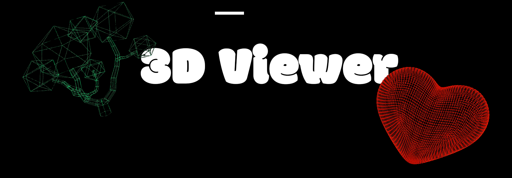
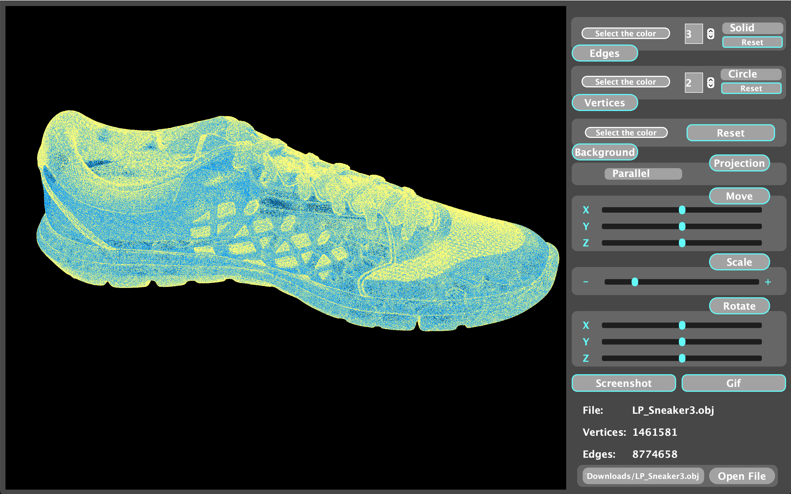

# **3D Viewer**



## **Information**
3DViewer_v2.0 is a C++ application for viewing 3D wireframe models in the object-oriented programming paradigm. It supports loading object files, rendering models with adjustable transformations (scaling, rotation, translation), and provides user-friendly controls for navigation. The application follows the MVC architecture and utilizes design patterns such as Strategy, Builder, and Facade to ensure modularity and maintainability.

**This project displays an object file with more than 10 million edges and vertices with a latency of less than 0.5 seconds**

### **Color**


### **Affin Transformations**


## **What this app can do**


1. Selecting model file and displaying its name: The user can select the model file through the dialog box and the name of the selected file will be displayed in the corresponding field on the interface.

2. Visualization of the wireframe model: The visualization area allows you to display the loaded model as a wireframe model representing vertices and edges.

3. Model translation: The user can specify parameters for model translation along X, Y and Z axes using the corresponding input fields and buttons.

4. Model rotation: The user can set the rotation angle for the model around the X, Y and Z axes using the input fields and buttons.

5. Model scaling: The user can change the scale of the model using the input field and buttons.

6. Information about the loaded model: The information section displays the name of the loaded file, the number of vertices and edges in the model.

7. User settings:
 - Projection type. User can select the projection type to display the model parallel or center.

 - Rib and vertex display settings. User can configure the type (solid, dashed), color and thickness of the edges, and the vertex display method (none, circle, square), color and size.

 - Background color selection: The user can select the background color for the visualization area.
 
    User settings are saved, so that they will be restored the next time the application is launched.

8. Creating a screenshot: The user can click the "screenshot" button to save the current view of the model as a screenshot image.

9. Creating a gif animation (gif): The user can click the "gif" button to record a screencast of the current user affine transformations of the model into gif animation format. The animation will have a resolution of 640x480, a speed of 10 frames per second and a duration of 5 seconds.

## **Supported platforms**

- [x] Linux
- [x] MacOS
- [ ] Windows

## **Stack**

<div>
    &nbsp;
    &nbsp;
 &nbsp;
 <p>OpenGl Version 3.3</p>
</div>

## **Installation**

```shell
git clone https://github.com/Back6pace/3D-Viewer.git
cd 3D-Viewer/src
make
make start
```

